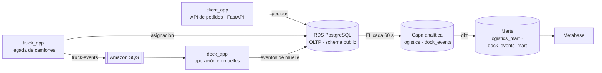

# 🚚 Centro Logístico — Pipeline de datos end-to-end en AWS


[](https://github.com/RicardoEdreiraPenas/centro-logistico/actions/workflows/tests.yml)

Simulación de un centro logístico real: camiones que llegan con tractora y remolque, pedidos de clientes con palets y peso, asignación a 10 muelles de carga y descarga, y seguimiento de la operación en tiempo real. Los eventos viajan por **Amazon SQS**, se guardan en **PostgreSQL (RDS)**, se transforman con **dbt** y se visualizan en **Metabase**. Toda la infraestructura se levanta con **Terraform**.

Proyecto del Máster en Big Data y Cloud de EDEM (2025–2026). Conecta con mi experiencia como Traffic Manager coordinando 45–50 camiones diarios: aquí el reto es el mismo, pero visto desde el dato.

---

## Arquitectura



| Capa | Servicio | Qué hace |
| --- | --- | --- |
| Pedidos | `client_app` (FastAPI) | Crea pedidos de carga y descarga con productos, palets y peso; caducan si no se asignan |
| Llegada de camiones | `truck_app` | Genera camiones (matrícula de tractora y remolque), les asigna pedidos y publica el evento en SQS |
| Operación en muelles | `dock_app` | Consume SQS, asigna uno de los 10 muelles y ejecuta descarga y carga respetando la capacidad del camión |
| Mensajería | Amazon SQS | Desacopla la llegada de camiones de la operación en muelles |
| OLTP y capa analítica | RDS PostgreSQL | Datos operativos (`public`) y analíticos (`logistics`, `dock_events`) |
| Extracción y carga | `el_logistics` | Copia cada 60 s las tablas operativas a la capa analítica |
| Transformación | dbt-postgres | Modelos base y marts de negocio |
| Visualización | Metabase (Docker) | Cuadros de mando de la operación |
| Infraestructura | Terraform | Una EC2 por servicio, rol de IAM, security groups y claves |

## Reglas de negocio simuladas

- **Capacidad del camión:** máximo 24.000 kg y 33 palets (configurable por variable de entorno). Si un pedido no cabe, se sirve parcialmente o queda pendiente.
- **Secuencia en muelle:** primero descarga y después carga.
- **Caducidad de pedidos:** un pedido sin camión asignado caduca a los 10 minutos.
- **10 muelles fijos** que pasan de `available` a `occupied` y se liberan al terminar.

## Modelos dbt

| Modelo | Qué responde |
| --- | --- |
| `trucks_at_docks` | Qué camión está en qué muelle y qué operación hace ahora mismo |
| `expanded_dock_events` | Histórico de operaciones con palets, peso, origen y destino |
| `truck_entry_exit_order` | Orden de entrada y salida de camiones |

## API de pedidos (`client_app`)

| Método | Endpoint | Descripción |
| --- | --- | --- |
| `POST` | `/orders` | Crea un pedido de carga o descarga |
| `GET` | `/orders` | Lista pedidos, filtrables por estado |
| `GET` | `/orders/{id}` | Detalle de un pedido |
| `GET` | `/clients` · `/products` · `/inventory` | Clientes, catálogo e inventario |
| `GET` | `/floor/view` | Vista en directo de los muelles |

---

## Cómo ejecutarlo

### 1. Configuración

```bash
cp .env.example .env            # rellena RDS_HOST y RDS_PASSWORD
python3 -m venv .venv && source .venv/bin/activate
pip install -r requirements.txt
```

Las credenciales se leen siempre de variables de entorno. Ningún secreto vive en el código ni en el repositorio.

### 2. Tests

```bash
pytest -q        # 28 tests de truck_app, dock_app y client_app
```

### 3. Infraestructura en AWS

```bash
cd terraform
cp terraform.tfvars.example terraform.tfvars   # VPC, subred y datos de RDS
terraform init
terraform plan
terraform apply
```

Terraform crea una instancia EC2 por servicio y le inyecta la configuración al arrancar. Las instancias acceden a SQS mediante un **rol de IAM**, sin claves de AWS en ningún fichero.

### 4. Capa analítica

```bash
python setup_db.py                            # crea los schemas analíticos
python -m analytical_layer.el_logistics.main  # EL cada 60 s

cd analytical_layer/dbt_template/edem_project
dbt run                                       # requiere ~/.dbt/profiles.yml apuntando a RDS

cd ../.. && docker compose up -d              # Metabase en http://localhost:3000
```

---

## Estructura

```
├── client_app/             API de pedidos (FastAPI)
├── truck_app/              Generador de camiones y publicación en SQS
├── dock_app/               Consumidor SQS y operación en muelles
├── utils/                  Conexión a PostgreSQL y cliente SQS
├── analytical_layer/
│   ├── el_logistics/       Extracción y carga a la capa analítica
│   ├── dbt_template/       Proyecto dbt (base y marts)
│   └── docker-compose.yml  Metabase
├── terraform/              Infraestructura como código
├── tests/                  Tests con pytest
└── setup_db.py · setup_sqs.py
```

## Autor

**Ricardo Edreira Penas** · Data Analyst · Data Engineer Junior
[LinkedIn](https://www.linkedin.com/in/ricardoedreira) · [GitHub](https://github.com/RicardoEdreiraPenas)
